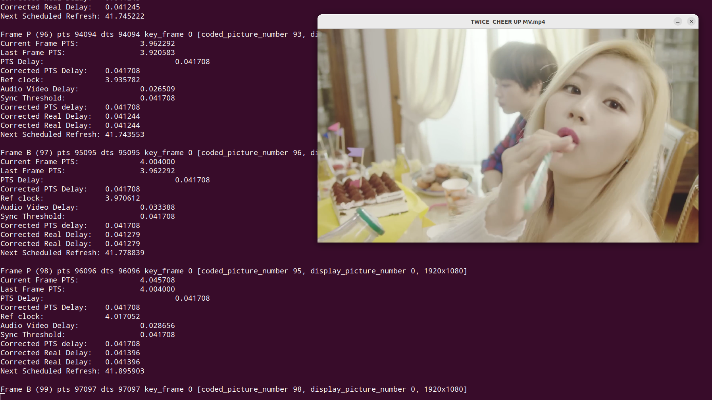

Simple Video Player with SDL
=============
How to run:
1. clone this repository
2. `$ mkdir build`
3. `$ cd build`
4. `$ sudo cmake ..`
5. `$ sudo make`
6. `$ ./fideo <filename> <max-frames-to-decode>` 

To run until finish, just give a very large number to max-frames-to-decode, example: `./fideo example.mp4 99999999`

